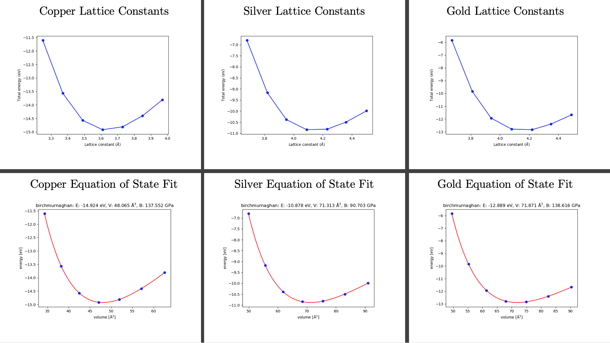
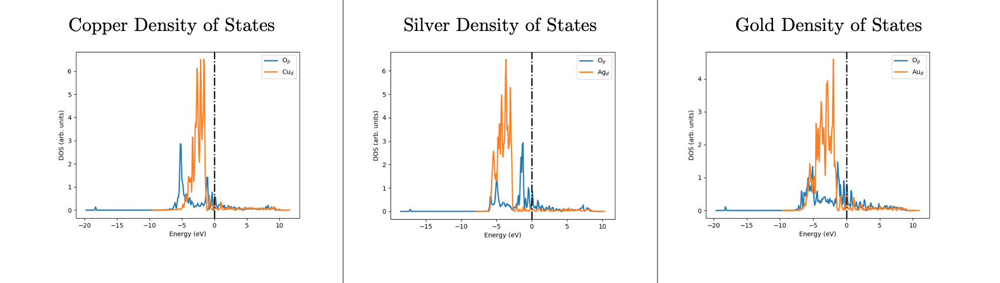

# Homework 6 - Cody R. Drisko and Garrett Tow

*NOTE*: The metals we were tasked with analyzing were Cu, Ag, and Au. All calculations, input/output files, and code can be found in my GitHub repository located [here](https://github.com/crdrisko/ND-Coursework).

## Question 1)

From **Table 1.1** below, we can see that the electron configurations for our metals match what we would expect. Cu, Ag, and Au all belong to the 11th group on the periodic table meaning that they should have similar chemical properties (i.e. electron configurations). What we see is that rather than fill the last s-orbital for each metal, which is what we would expect according to the Mandelung rule (Aufbau Principle), the metals stabilize their nearly filled d-orbitals by taking that last electron from the s. Thus, all electron configurations end with: (n)d<sup>10</sup> (n+1)s<sup>1</sup>.

**Table 1.1:** Electron configurations for the metal atoms (in order of increasing energy).

| **Metal** | **Electron Configuration** |
|:----------|:---------------------------|
| **Cu**    | 1s<sup>2</sup> 2s<sup>2</sup> 2p<sup>6</sup> 3s<sup>2</sup> 3p<sup>6</sup> 3d<sup>10</sup> 4s<sup>1</sup> |
| **Ag**    | 1s<sup>2</sup> 2s<sup>2</sup> 2p<sup>6</sup> 3s<sup>2</sup> 3p<sup>6</sup> 3d<sup>10</sup> 4s<sup>2</sup> 4p<sup>6</sup> 4d<sup>10</sup> 5s<sup>1</sup> |
| **Au**    | 1s<sup>2</sup> 2s<sup>2</sup> 2p<sup>6</sup> 3s<sup>2</sup> 3p<sup>6</sup> 3d<sup>10</sup> 4s<sup>2</sup> 4p<sup>6</sup> 4d<sup>10</sup> 5s<sup>2</sup> 4f<sup>14</sup> 5p<sup>6</sup> 5d<sup>10</sup> 6s<sup>1</sup> |

**Code 1.1:** Python code used to run VASP calculations for the metal atoms: Cu, Ag, and Au.

```Python
## VASP, ASE, and Python Packages ##

VASPRC['queue.q'] = 'long'
VASPRC['queue.nprocs'] = 24
VASPRC['queue.pe'] = 'mpi-24'

for metal in ['Cu', 'Ag', 'Au']:
    ## Question 1 - Single Metal Atoms ##
    metal_atom = Atoms( [ Atom(metal, [0, 0, 0]) ],
                          cell=(8, 9, 10) )
    metal_atom.center()

    calc = Vasp('%s/%s-atom' %(metal, metal),
            xc = 'PBE',     ## the exchange-correlation functional
        ismear = 1,         ## Methfessel-Paxton smearing
         encut = 400,       ## energy cutoff
         atoms = metal_atom)

    calc.calculate()
```

---

<div style="page-break-after: always;"></div>

## Question 2)

Plotted in **Figure 2.1**, we can see the energies of each of our metals converges to a difference of 0.02 eV between 7 and 9 k-points. For Au, it actually doesn't converge to the selected tolerance until between 9 and 11 k-points, but it is close to convergence at 7. I think the most reliable and cost effective number of k-points is 9 for these three metals. The code for this analysis is shown in both **Code 2.1** and **Code 2.2**.

**Figure 2.1:** Convergence of the energy for the Cu, Ag, and Au metals as we varied the number of k-points in the grid.


<div style="page-break-after: always;"></div>

**Code 2.1:** Bash script to grab the necessary data from the OUTCAR files and use Python to plot the energies.

```bash
#!/bin/bash

if [ $1 = "Q2" ]
then
  for metal in Cu Ag Au
  do
    for dir in $metal/$metal-kpt-convergence/kpt-{3..11..2}
    do
        energyArray=( $(grep TOTEN $dir/OUTCAR | tail -n 1) )

      if [ ${dir##*-} -ne 3 ]
      then
        lastEnergy=( $(grep $((${dir##*-} - 2)) $metal/energies.dat  | tail -n 1) )
        echo ${dir##*-} ${energyArray[4]} $( echo "${lastEnergy[1]} - ${energyArray[4]}" | bc ) >> $metal/energies.dat
      else
        echo ${dir##*-} ${energyArray[4]} 0 > $metal/energies.dat
      fi
    done
  done

  python3 runMetals.py Plot2

elif [ $1 = "Q3" ]
then
  for metal in Cu Ag Au
  do
    for dir in $metal/$metal-EOS/*
    do
      energyArray=( $(grep TOTEN $dir/OUTCAR | tail -n 1) )
      volumeArray=( $(grep volume $dir/OUTCAR | tail -n 1) )
      echo ${dir##*-} ${energyArray[4]} ${volumeArray[4]} >> $metal/$metal-EOS/energies.dat
    done
  done

  python3 runMetals.py Plot3 > EOS-Energies.dat
fi
```

<div style="page-break-after: always;"></div>

**Code 2.2:** Python code used to run VASP calculations for the metal atoms: Cu, Ag, and Au.

```Python
## VASP, ASE, and Python Packages ##

VASPRC['queue.q'] = 'long'
VASPRC['queue.nprocs'] = 24
VASPRC['queue.pe'] = 'mpi-24'

for metal in ['Cu', 'Ag', 'Au']:
    ## Question 2 - k-point Convergence ##
    kPoints = [3, 5, 7, 9, 11]

    for k in kPoints:
        metal_cubic = bulk(metal, 'fcc', cubic = True)

        calc = Vasp('%s/%s-kpt-convergence/kpt-%s' %(metal, metal, k),
                xc = 'PBE',
            ismear = 1,
             encut = 400,
             kpts = [k,k,k],
             atoms = metal_cubic)

        calc.calculate()

### Plotting ###
if argv[1] == "Plot":
    data_Cu = np.loadtxt("Cu/energies.dat", dtype=float)
    N_Cu= np.size(data_Cu)
    kpoints_Cu = data_Cu[0:N_Cu:1, 0]
    energies_Cu = data_Cu[0:N_Cu:1, 1]

    data_Ag = np.loadtxt("Ag/energies.dat", dtype=float)
    N_Ag = np.size(data_Ag)
    kpoints_Ag = data_Ag[0:N_Ag:1, 0]
    energies_Ag = data_Ag[0:N_Ag:1, 1]

    data_Au = np.loadtxt("Au/energies.dat", dtype=float)
    N_Au = np.size(data_Au)
    kpoints_Au = data_Au[0:N_Au:1, 0]
    energies_Au = data_Au[0:N_Au:1, 1]

    plt.plot(kpoints_Cu, energies_Cu, 'ro-', label="Cu Metal")
    plt.plot(kpoints_Ag, energies_Ag, 'go-', label="Ag Metal")
    plt.plot(kpoints_Au, energies_Au, 'bo-', label="Au Metal")
    plt.xlabel("k-Points")
    plt.ylabel("Total Energy (eV)")
    plt.ylim(-15.5, -9.5)
    plt.legend()
    plt.savefig('images/metal-kpt-convergence.png')
    plt.show()
```

---

<div style="page-break-after: always;"></div>

## Question 3)

For the experimentally determined lattice constants, I found [this](https://onlinelibrary.wiley.com/doi/pdf/10.1002/9783527633296.app5) resource and used the fcc values they presented. For fcc-copper, the experimental value of the lattice constant is 3.61 &#8491; and our optimal lattice constant was found to be 3.636 &#8491;. For fcc-silver, we calculated an optimal lattice constant of 4.147 &#8491; compared to the literature value of 4.09 &#8491;. Lastly, fcc-gold has a lattice constant of 4.08 &#8491; according to experiment and we calculated the optimal value as 4.158 &#8491;. Cu has the best agreement with its literature value, but Ag and Au aren't so far off.

To come up with these results we used a 9 k-point grid, which we determined was best in the previous question. The code used to run these calculations is shown in **Code 2.1** and **Code 3.2**. The plots of the equation of state fitting and lattice constants are shown in **Figure 3.1**.

**Figure 3.1:** All the lattice constant plots and equation of state fits for Cu, Ag, and Au.



**Code 3.1:** Python code used to run VASP calculations for the metal atoms: Cu, Ag, and Au.

```Python
## VASP, ASE, and Python Packages ##

VASPRC['queue.q'] = 'long'
VASPRC['queue.nprocs'] = 24
VASPRC['queue.pe'] = 'mpi-24'

for metal in ['Cu', 'Ag', 'Au']:
    ## Question 3 - Finding bulk metal lattice constants ##
    if metal == 'Cu':
        exp = 3.61
    elif metal == 'Ag':
        exp = 4.09
    elif metal == 'Au':
        exp = 4.08

    A = np.linspace(exp * 0.9, exp * 1.1, 7)

    for a in A:
        metal_cubic = bulk(metal, 'fcc', a = a, cubic = True)

        calc = Vasp('%s/%s-EOS/a-%1.2f' %(metal, metal, a),
                xc = 'PBE',
            ismear = 1,
             encut = 400,
              kpts = [9,9,9],         ## Converged k-points from Q2
             atoms = metal_cubic)

            calc.calculate()

### Plotting ###
if argv[1] == "Plot":
    for metal in ['Cu', 'Ag', 'Au']:
        data = np.loadtxt("%s/%s-EOS/energies.dat" %(metal, metal), dtype=float)

        N = np.size(data)
        lattice = data[0:N:1, 0]
        energies = data[0:N:1, 1]
        volumes = data[0:N:1, 2]

        plt.plot(lattice, energies, 'bo-')
        plt.xlabel('Lattice constant ($\\AA$)')
        plt.ylabel('Total energy (eV)')
        plt.savefig('images/%s-fcc-lattice.png' %metal)
        plt.show()

        # Let's fit this to an equation of state

        eos = EquationOfState(volumes, energies, eos='birchmurnaghan')
        v0, e0, b = eos.fit()
        a0 = v0**(1/3)
        eos.plot(filename='images/%s-EOS.png' %metal, show = True)

        print(metal)
        print('Minimum Energy = {0:1.3f} eV'.format(e0))
        print('Optimal Volume = {0:1.3f} cubic angstroms'.format(v0))
        print('Optimal lattice constant = {0:1.3f} angstroms'.format(a0))
        print()
```

---

<div style="page-break-after: always;"></div>

## Question 4)

The cohesive energies of each of our metals is shown in **Table 4.1**. The calculations that went into those values used the following equation: E<sub>coh</sub> = M<sub>(g)</sub> - (E<sub>bulk</sub> / N<sub>atoms</sub>). The literature values we used to compare our values to came from the source [here](http://www.knowledgedoor.com/2/elements_handbook/cohesive_energy.html). Overall, the agreement is okay, copper and silver agree with their literature values much more than gold does. Most likely a more-accurate calculation would be necessary for any useable value, but these are definitely in the ball park. One thing to note is that the literature's trend of Au > Cu > Ag, is not seen in our calculations.

**Table 4.1:** Cohesive energies of Cu, Ag, and Au metals.

| **Metal** | **M<sub>(g)</sub> (eV)** | **M<sub>(s)</sub> (eV)** | **Cohesive Energy (eV)** | **Literature Values (eV)** |
|:---------:|:------------------------:|:------------------------:|:------------------------:|:--------------------------:|
| **Cu**    | -0.05220394              | -3.72941851              | 3.67721457               | 3.49                       |
| **Ag**    | -0.05720515              | -2.71020146              | 2.65299631               | 2.95                       |
| **Au**    | -0.04368016              | -3.19669770              | 3.15301754               | 3.81                       |

---

<div style="page-break-after: always;"></div>

## Question 5)

The following equation was used to calculate the surface energies of the metals: &#x03B3; = (E<sub>slab</sub> - n*E<sub>bulk</sub>)/ 2A. For each of the metals we looked at, the number of atoms in the surface was 12 and in the bulk it was 4, giving us an n value of 3. I obtained the surface areas for the metals by multiplying the volume of the slab by the length of the slab in z, as this is the accessible area of the slab. The values are all shown in **Table 5.1**, and the code used to run these calculations is shown in **Code 5.1**.

**Table 5.1:** Surface energies of Cu, Ag, and Au metal slabs.

| **Metal** | **E<sub>slab</sub> (eV)** | **E<sub>bulk</sub> (eV)** | **Surface Area (&#8491;)** | **Surface Energy (eV/&#8491;)** |
|:---------:|:-------------------------:|:-------------------------:|:--------------------------:|:-------------------------------:|
| **Cu**    | -40.95036609              | -14.91767405              | 22.89853514                | 0.08303274                      |
| **Ag**    | -29.80874611              | -10.84080583              | 29.78714788                | 0.04555104                      |
| **Au**    | -35.86586947              | -12.78679078              | 29.94527109                | 0.04165103                      |

**Code 5.1:** Python code used to run VASP calculations for the metal atoms: Cu, Ag, and Au.

```Python
## VASP, ASE, and Python Packages ##

VASPRC['queue.q'] = 'long'
VASPRC['queue.nprocs'] = 24
VASPRC['queue.pe'] = 'mpi-24'

for metal in ['Cu', 'Ag', 'Au']:
    ## Question 5 - Surfaces and Surface Energies ##
    if metal == 'Cu':
        a = 3.636
    elif metal == 'Ag':
        a = 4.147
    elif metal == 'Au':
        a = 4.158

    atoms = fcc111(metal, size=(2,2,3), vacuum=10.0, a=a)

    calc = Vasp('%s/%s-surface' %(metal, metal),
            xc = 'PBE',
        ismear = 1,
         encut = 400,
        ibrion = 2,
          kpts = [9,9,1],
           nsw = 20,
         atoms = atoms)

    calc.calculate()
```

---

<div style="page-break-after: always;"></div>

## Question 6)

To answer this question we used the following equation: E<sub>ads</sub> = E<sub>O-surf</sub> - E<sub>surf</sub> - (0.5*E<sub>O<sub>2</sub></sub>), and the results of those calculations are shown in **Table 6.1**. By far and away, copper has the most favorable binding with oxygen, and gold has the least favorable binding. The code used to run these calculations is shown in **Code 6.1**, however for the O<sub>2</sub> energies, we obtained those results in the previous homework, so that code was shown previously.

**Table 6.1:** Binding energies of Cu, Ag, and Au metal slabs with oxygen.

| **Metal** | **E<sub>O-surf</sub> (eV)** | **E<sub>surf</sub> (eV)** | **E<sub>O<sub>2</sub></sub> (eV)** | **E<sub>ads</sub> (eV)** |
|:---------:|:---------------------------:|:-------------------------:|:----------------------------------:|:------------------------:|
| **Cu**    | -47.60038162                | -40.95036609              | -9.86466070                        | -1.71768518              |
| **Ag**    | -35.23772263                | -29.80874611              | -9.86466070                        | -0.49664617‬              |
| **Au**    | -40.96021610                | -35.86586947              | -9.86466070                        | -0.16201628              |

**Code 6.1:** Python code used to run VASP calculations for the metal atoms: Cu, Ag, and Au.

```Python
## VASP, ASE, and Python Packages ##

VASPRC['queue.q'] = 'long'
VASPRC['queue.nprocs'] = 24
VASPRC['queue.pe'] = 'mpi-24'

for metal in ['Cu', 'Ag', 'Au']:
    ## Question 6 - Adsorbates and Adsorption Energies ##
    if metal == 'Cu':
        a = 3.636
    elif metal == 'Ag':
        a = 4.147
    elif metal == 'Au':
        a = 4.158

    atoms = fcc111(metal, size=(2,2,3), vacuum=10.0, a=a)
    add_adsorbate(atoms, 'O', height=1.2, position='fcc')

    calc = Vasp('%s/O-on-%s-fcc' %(metal, metal),
            xc = 'PBE',
        ismear = 1,
         encut = 400,
        ibrion = 2,
          kpts = [9,9,1],
           nsw = 20,
         atoms = atoms)

    calc.calculate()
```

---

<div style="page-break-after: always;"></div>

## Question 7)

When we look at the trends from the Density of State plots shown in **Figure 7.1** and the results of the adsorption energies (**Table 6.1**), we can see that the more the oxygen atom's p-orbitals and the metal's d-orbitals overlap, the higher the adsorption energy goes. According to the [paper](https://www.nature.com/articles/376238a0.pdf), this is due to a higher amount of electron-electron repulsion as we fill up states. When the metal orbitals and oxygen orbitals overlap (each occupied), we are going to have an increase in energy. This agrees with the trend we saw in the previous question.

As for the cohesive energies, it is a little difficult to say whether or not the degree of filling actually plays a role or not. For our metals, all belong to the same group, and as such, should fill similarly. On top of that, our trend for the cohesive energy did not match the literature's. Ultimately, I think we can say that regardless of whether or not the degree of filling affects the cohesive energy, the filling plays a much larger role in adsorption.

**Figure 7.1:** Atom-projected densities of states for Cu, Ag, and Au metal surfaces and an adsorbate density states for an adsorbed oxygen atom on the metal surfaces.



**Code 7.1:** Python code used to run VASP calculations for the metal atoms: Cu, Ag, and Au.

```Python
## VASP, ASE, and Python Packages ##

VASPRC['queue.q'] = 'long'
VASPRC['queue.nprocs'] = 24
VASPRC['queue.pe'] = 'mpi-24'

for metal in ['Cu', 'Ag', 'Au']:
    ## Question 7 - Density of States ##

    # Metal Surface #
    calc = Vasp('%s/%s-surface' %(metal, metal))
    atoms = calc.get_atoms()

    calc = Vasp('%s/%s-ados' %(metal, metal),
            xc = 'PBE',
        ismear = 1,
            encut = 400,
            kpts = [9,9,1],
        lorbit = 10,
            atoms = atoms)

    calc.calculate()

    # Adsorbate #
    calc = Vasp('%s/O-on-%s-fcc' %(metal, metal))
    atoms = calc.get_atoms()

    calc = Vasp('%s/O-on-%s-fcc-ados' %(metal, metal),
            xc = 'PBE',
        ismear = 1,
            encut = 400,
            kpts = [9,9,1],
        lorbit = 10,
            atoms = atoms)

    calc.calculate()

### Plotting ###
elif argv[1] == "Plot7":
    for metal in ['Cu', 'Ag', 'Au']:
        calc = Vasp('%s/O-on-%s-fcc-ados' %(metal, metal))

        p_energies, p_dos = calc.get_ados(12, 'p')
        plt.plot(p_energies, p_dos, label='O$_p$', lw=2)

        calc = Vasp('%s/%s-ados' %(metal, metal))
        clean_energies, d_dos = calc.get_ados(11, 'd')
        plt.plot(clean_energies, d_dos, label='%s$_d$' %metal, lw=2)

        plt.axvline(ls='-.', color='k', lw=2)
        plt.xlabel('Energy (eV)')
        plt.ylabel('DOS (arb. units)')
        plt.legend()
        plt.savefig('images/%s-adsorbate-dos.png' %metal)
        plt.show()
```
