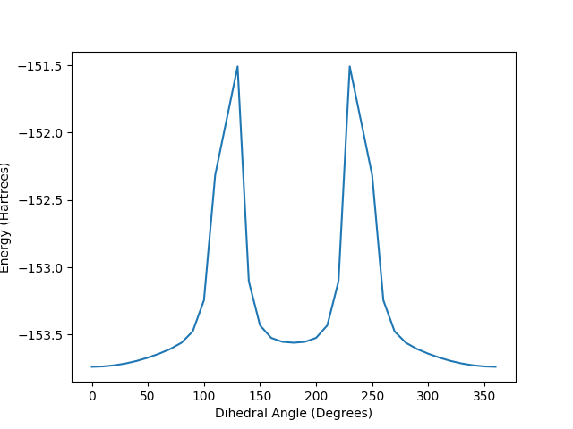

# Homework 4 - Cody R. Drisko

## Question 1)

a) From **Table 1.1** we can see that the bond lengths of the equilibrium structures match our chemical intuition for what these should be. The shortest bonds in both structures belongs to the molecules actually bonded to H<sub>1</sub>, while the longest distance occur between the H<sub>1</sub> atom and whatever it isn't bonded to. For the C - C and C - O bonds, it is easy to see that the bond length shortens when the atoms are double bonded to each other.

b) The acetaldehyde optimization was trivial to perform. I optimized the molecule using a Quadratic Approximation algorithm and then verified the results using a Quasi-Newton Raphson algorithm. Vinyl Alcohol proved to be more difficult than I anticipated and required a Quadratic Approximation, Quasi-Newton Raphson, and Ration Function Optimization algorithm before the vibrational spectra finally reflected a true energy minima. In all cases, the tolerance was set to 0.0001, the hessian was guessed, and the number of steps used was 50. The template I used for these optimizations is shown in **Code 1.1**.

c) **Code 1.2** shows the input files for these vibrational calculations. Both the optimized structured of acetaldehyde and vinyl alcohol were at true minima as the eigenvalues of their Hessians were all positive. For vinyl alcohol, the only way I could get the vibration calculation to succeed was by recognizing that the molecule had CS symmetry and locking it there. In acetaldehyde, we expect to see the C = O stretching frequency vs. in vinyl alcohol, we should see C = C and an O - H stretching. These peaks will be what lets us know we have created the product we want. **Figure 1.1** shows the overlaid frequency plots and the code to plot those is shown in **Code 1.4**.

d) The results of the single point energy calculations are shown in **Table 1.2**. As we would expect, the Product - Reactant energy will be related to the enthalpy of the reaction and the TS - Reactant energy will be related to the Gibbs free energy or activation energy of the barrier. The input file is shown in **Code 1.3** for these MP2 calculations.

e) The reaction enthalpy at 298K, H(298), is roughly 73.713 kJ/mol. Thus, the reaction is endothermic and we need to supply energy to the system to go from acetaldehyde to vinyl alcohol.

<div style="page-break-after: always;"></div>

**Code 1.1:** Sample GAMESS input file for a Geometry Optimization.

```FORTRAN
 $CONTRL SCFTYP=RHF RUNTYP=OPTIMIZE DFTTYP=B3LYP ICHARG=0 MULT=1 COORD=CART $END
 $STATPT METHOD=(QA/NR/RFO) OPTTOL=0.0001 HESS=GUESS NSTEP=50 $END
 $BASIS GBASIS=N31 NGAUSS=6 NDFUNC=1 $END
 $DATA
Title Geometry Optimization
C1 1
...
 $END
```

**Code 1.2:** Sample GAMESS input file for a Vibrational Analysis.

```FORTRAN
 $CONTRL SCFTYP= RHF RUNTYP=HESSIAN DFTTYP=B3LYP ISPHER=1 MULT=1 COORD=CART $END
 $SCF DIRSCF=.TRUE. $END
 $BASIS GBASIS=N31 NGAUSS=6 NDFUNC=1 $END
 $FORCE METHOD=SEMINUM $END
 $DATA
Title Vibrational Analysis
C1 1
...
 $END
```

**Code 1.3:** Sample GAMESS input file for a Energy Calculation with MP2.

```FORTRAN
 $CONTRL SCFTYP=RHF MPLEVL=2 RUNTYP=ENERGY ICHARG=0 MULT=1 COORD=CART $END
 $BASIS GBASIS=N31 NGAUSS=6 NDFUNC=1 $END
 $DATA
Title Single-Point Energy Calculation
C1 1
...
 $END
```

<div style="page-break-after: always;"></div>

**Table 1.1:** Internal Coordinates of some of the bonds in the Acetaldehyde and Vinyl Alcohol structures. Lengths in parentheses denote non-bonded distances.

| | **Acetaldehyde** | **Transition State** | **Vinyl Alcohol** |
|:---|:---:|:---:|:---:|
| **H1 - C (&#8491;)** | 1.093   | (1.524) | (2.485) |
| **C - C (&#8491;)**  | 1.509   | 1.412   | 1.335   |
| **C - O (&#8491;)**  | 1.211   | 1.285   | 1.363   |
| **O - H1 (&#8491;)** | (2.581) | (1.291) | 0.972   |

**Table 1.2:** Single-Point Energy calculations of Acetaldehyde and Vinyl Alcohol using the MP2/6-31G(d) level theory. ZPE's were scaled by 0.9613 as they were calculated using B3LYP through a vibrational analysis.

| | **Product - Reactant (kJ/mol)** | **TS - Reactant (kJ/mol)** |
|:---|:---:|:---:|
| **Base Calc**     | 70.958 | 383.519 |
| **MP2/6-31G(d)**  | 69.942 | 318.031 |
| **ZPE**           | 2.250 | -14.214 |
| **MP2 + ZPE**     | 72.192 | 303.816 |
| **&#x394;H(tot)** | 1.521 | N/A |
| **&#x394;G(tot)** | N/A | -12.484 |
| **&#x394;H(298)** | 73.713 | N/A |
| **&#x394;G(298)** | N/A | 291.332 |

**Figure 1.1:** Results of the vibrational frequency analysis of Acetaldehyde, the Transition State, and Vinyl Alcohol.


**Code 1.4:** Python script to produce the two plots for this HW assignment.

```Python
import numpy as np
import matplotlib.pyplot as plt

### Results of the Vibrational Analysis ###
data_va = np.loadtxt("vinylAlcohol/vinylAlcohol_spec.jdx", dtype=float, comments='#')

N_va = np.size(data_va)
frec_va = data_va[0:N_va:1, 0]
int_va = data_va[0:N_va:1, 1]

data_ts = np.loadtxt("TS/TS_spec.jdx", dtype=float, comments='#')

N_ts = np.size(data_ts)
frec_ts = data_ts[0:N_ts:1, 0]
int_ts = data_ts[0:N_ts:1, 1]

data_a = np.loadtxt("acetaldehyde/acetaldehyde_spec.jdx", dtype=float, comments='#')

N_a = np.size(data_a)
frec_a = data_a[0:N_a:1, 0]
int_a = data_a[0:N_a:1, 1]

plt.figure(1)
plt.plot(frec_a, int_a, label="Acetaldehyde")
plt.plot(frec_ts, int_ts, label="Transition State")
plt.plot(frec_va, int_va, label="Vinyl Alcohol")

plt.xlabel("Scaled Frequencies (cm$^-1$) ")
plt.ylabel("Intensities")
plt.legend()
plt.savefig("Frequencies.pdf")


### Results of the Scanning Technique ###
data_scan = np.loadtxt("scan/allEnergies.dat", dtype=float)

N_scan = np.size(data_scan)
angle = data_scan[0:N_scan:1, 0]
energy = data_scan[0:N_scan:1, 1]

plt.figure(2)
plt.plot(angle, energy)

plt.xlabel("Dihedral Angle (Degrees)")
plt.ylabel("Energy (Hartrees)")
plt.legend()
plt.savefig("Energies.pdf")
```

---

<div style="page-break-after: always;"></div>

## Question 2)

a) Originally I performed a series of calculations in which I varied the dihedral angle from 0 to 180 degrees. When running those, I realized that the atoms would run into one another at 120 degrees, so I did another scan from -180 to 0 degrees and stitched the two together. The input file is shown in **Code 2.1** and the code to perform this scan is shown in **Code 2.2**. As seen in **Figure 2.1**, the Hydrogen has essentially free rein until it reaches ~90 degrees away in which the energy shoots up. Since the energy at 120 degrees couldn't run, it's difficult to give an exact number as this would be the largest energy. However, from 0 to 130 degrees, the barrier appears to be 5854.58 kJ/mol which is still extremely large.

**Code 2.1:** GAMESS template for the scan about the dihedral angle.

```FORTRAN
 $CONTRL SCFTYP=RHF DFTTYP=B3LYP RUNTYP=ENERGY
       ISPHER=1 MULT=1 COORD=ZMT NZVAR=15 $END
 $BASIS GBASIS=N31 NGAUSS=6 NDFUNC=1 $END
 $STATPT IFREEZ(1)=9 $END
 $DATA
Title Single Point Energy Calculation of Acetaldehyde
C1
C
C      1   1.5086892
O      2   1.2107245  1  124.7161
H      2   1.1145804  1  114.7739  3  180.0000  0
H      1   1.0926781  2  110.5176  3  ANG.      0
H      1   1.0983769  2  109.8265  3  121.4889  0
H      1   1.0983769  2  109.8265  3 -121.4889  0
 $END
```

**Figure 2.1:** Results of the scan about the dihedral angle.



<div style="page-break-after: always;"></div>

**Code 2.2:** Bash script to rotate the dihedral angle in acetaldehyde.

```Bash
modifyFiles()       #@ DESCRIPTION: Modify a file using sed
{                   #@ USAGE: modifyFiles fileName oldString newString
  sed "s/${2?}/${3?}/g" ${1?} > tempFile && mv tempFile ${1?}
}

angles=(-180 -170 -160 -150 -140 -130 -120 -110 -90 -80 -70 -60 -50 -40 -30 -20 -10 0 10 20 30 40 50 60 70 80 90 100 110 120 130 140 150 160 170 180)

for ang in ${angles[@]}
do
  if [ ${ang:0:1} = '-' ]
  then
    mkdir n${ang:1:${#ang}}-deg
    cd n${ang:1:${#ang}}-deg
  else  
    mkdir ${ang}-deg
    cd ${ang}-deg
  fi

  cp ../acetaldehyde_scan.inp acetaldehyde.inp

  modifyFiles acetaldehyde.inp ANG $ang

  rungms acetaldehyde.inp > acetaldehyde.out

  energyArray=( $(grep FINAL\ R-B3LYP\ ENERGY\ IS acetaldehyde.out) )
  energy=${energyArray[4]}

  printf "%s\t %s\n" $ang $energy >> ../allEnergies.dat

  cd ../
done
```

---

<div style="page-break-after: always;"></div>

## Question 3)

a) For the transition state, the results in **Table 1.1** show that this structure is indeed an intermediate between the reactant and product. The distances for the C - O and C - C bonds lie between a double and single bond, and the H<sub>1</sub> atom is not bonded to either the carbon or oxygen as it is transitioning between the two.

b) The single imaginary mode for this transition state occurs at a scaled frequency of 2110.28 cm<sup>-1</sup> and has an intensity of 8.9561. From the animation on WebMO, we can see that this vibration corresponds to the motion of the hydrogen atom from the carbon atom to the oxygen parallel to the C - C bond.

c) The results of my calculations are shown in **Table 1.2** and intuitively these values make sense. The Product - Reactant energy corresponds to the enthalpy of the reaction and should be noticeably lower than the TS - Reactant energy. That energy corresponds to the activation energy or Gibbs free energy of the Transition state.

d) The value of &#x394;G&#8225; at 298K is 291.332 kJ/mol. In the TST expression, this corresponds to a rate constant of 4.2334x10<sup>-39</sup> s<sup>-1</sup> which seems very small. The barrier is extremely large so it makes sense the rate constant would be small.

---

<div style="page-break-after: always;"></div>

## Question 4)

a) Based on the results shown in **Table 4.1**, we can see that the reaction including fluorine has an enthalpy of 73.011 kJ/mol, while the reaction without fluorine has an enthalpy of 73.713 kJ/mol. This means that the reaction with fluorine is less endothermic (more exothermic).

b) For the reaction barrier, the reaction containing fluorine has a &#x394;G of 294.770 kJ/mol, while the reaction without fluorine has a &#x394;G of 291.332 kJ/mol. This shows that the barrier is larger with the fluorine than without it.

c) This seems to be the opposite trend you'd expect based on the Bronsted-Evans-Polanyi relation because the activation energy and enthalpies should follow the same trend (i.e. if the enthalpy is higher, the activation energy should also be higher). Most likely I converted something incorrectly and the trend is reversed.  

**Table 4.1:** Single-Point Energy calculations of Acetaldehyde and Vinyl Alcohol with the substituted Fluorine using the MP2/6-31G(d) level theory. ZPE's were scaled by 0.9613 as they were calculated using B3LYP through a vibrational analysis.

| | **Product - Reactant (kJ/mol)** | **TS - Reactant (kJ/mol)** |
|:---|:---:|:---:|
| **Base Calc**     | 79.385 | 394.617 |
| **MP2/6-31G(d)**  | 70.732 | 321.496 |
| **ZPE**           | 1.276 | -14.726 |
| **MP2 + ZPE**     | 72.008 | 306.769 |
| **&#x394;H(tot)** | 1.003 | N/A |
| **&#x394;G(tot)** | N/A | -11.999 |
| **&#x394;H(298)** | 73.011 | N/A |
| **&#x394;G(298)** | N/A | 294.770 |

---

<div style="page-break-after: always;"></div>

## Question 5)

a) As we can see from **Table 5.1**, the energy difference is large in vinyl alcohol than it is in acetaldehyde to excite the molecule to the first excited state. This also means the wavelength of light required for this transition is shorter for vinyl alcohol. The GAMESS input is shown in **Code 5.1**.

**Code 5.1:** Sample GAMESS input file for an Energy Calculation with CIS.

```FORTRAN
 $CONTRL SCFTYP=RHF RUNTYP=ENERGY CITYP=CIS ICHARG=0 MULT=1 COORD=CART $END
 $BASIS GBASIS=N31 NGAUSS=6 NDFUNC=1 $END
 $DATA
Title Single-Point Energy Calculation
C1 1
...
 $END
```

**Table 5.1:** Energy differences and wavelengths from the CIS/6-31G(d) excited state calculations for Acetaldehyde and Vinyl Alcohol.

| | **Acetaldehyde** | **Vinyl Alcohol** |
|:---:|:---:|:---:|
| **Energy Difference (Hartrees)** | 0.1830 | 0.3096 |
| **Wavelength of Light (nm)**     | 249.03669 | 147.1988 |

---
