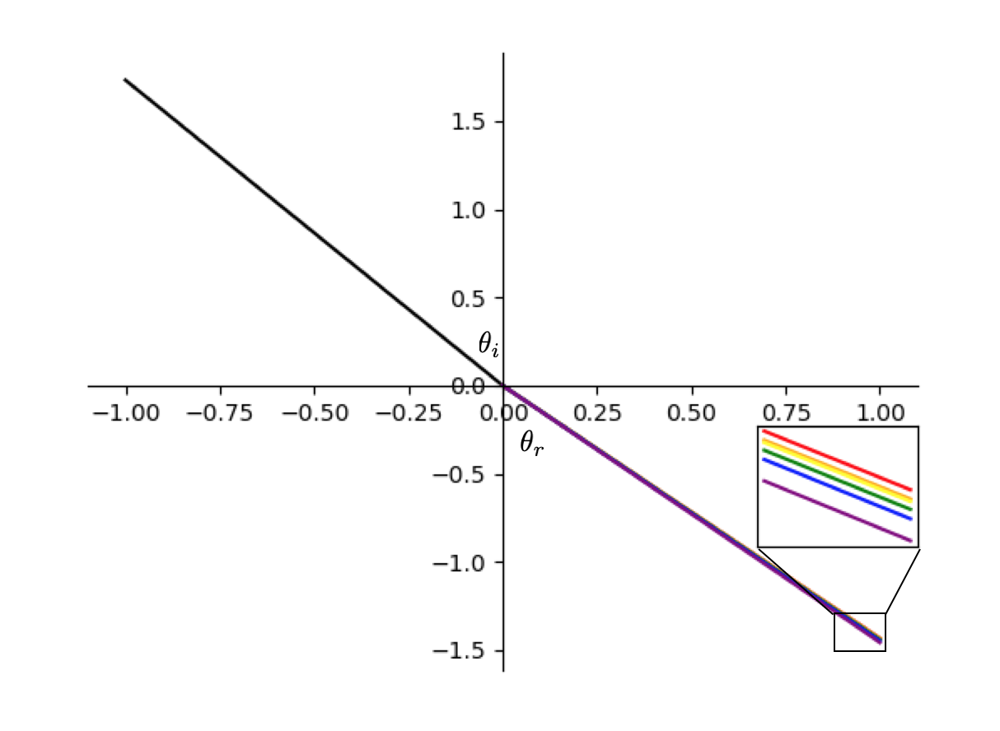
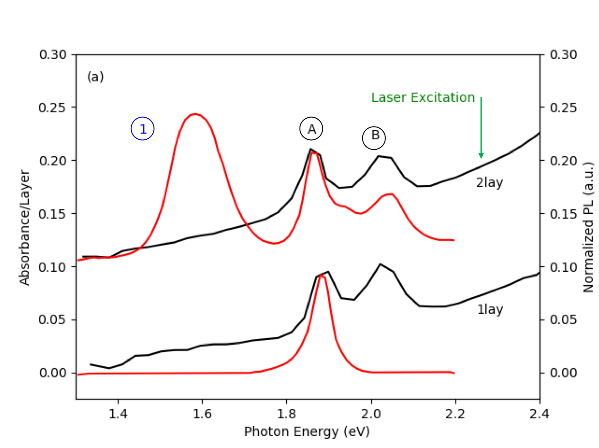

# Homework 2 - Cody R. Drisko

## Question 2)

A Snell's law plot of light entering BK7 glass at an incidence angle of 60 degrees and getting scattered at different angles is depicted in **Figure 2.1**. The BK7 data was retrieved from this [reference](https://refractiveindex.info/?shelf=glass&book=BK7&page=SCHOTT) and plotted using **Code 2.1**.

**Figure 2.1:** Snell’s Law plot from **Code 2.1**, with slight modifications made in PowerPoint.



<div style="page-break-after: always;"></div>

**Code 2.1:** Snell's law plot of light entering BK7 glass at a given angle of incidence.

```Python
import numpy as np
import matplotlib.pyplot as plt

class VisibleLight:
    def __init__(self, refractiveIndex, plotColor):
        self.refractiveIndex = refractiveIndex
        self.plotColor = plotColor

def calculateReflectionAngle(refractiveIndex, n_incident, angle_incident):
    return np.arcsin( (n_incident * np.sin(angle_incident)) / refractiveIndex )


n_incident = 1.0
angle_incident = np.pi / 3

## Visible light colors ##
red     = VisibleLight(1.5131, 'r')         ## Red Wavelength Range:    620-750 nm; n_BK7 = 1.5131 @ 700 nm
orange  = VisibleLight(1.5163, '#ffa500')   ## Orange Wavelength Range: 590-620 nm; n_BK7 = 1.5163 @ 600 nm
yellow  = VisibleLight(1.5171, 'y')         ## Yellow Wavelength Range: 570-590 nm; n_BK7 = 1.5171 @ 580 nm
green   = VisibleLight(1.5199, 'g')         ## Green Wavelength Range:  495-570 nm; n_BK7 = 1.5199 @ 525 nm
blue    = VisibleLight(1.5232, 'b')         ## Blue Wavelength Range:   450-495 nm; n_BK7 = 1.5232 @ 475 nm
violet  = VisibleLight(1.5308, '#800080')   ## Violet Wavelength Range: 380-450 nm; n_BK7 = 1.5308 @ 400 nm

## Plotting ##
x1 = np.linspace(-1, 0, 5)
x2 = np.linspace(0, 1, 5)
x3 = np.linspace(.98, 1, 5)

fig, ax1 = plt.subplots()

left, bottom, width, height = [0.75, 0.265, 0.15, 0.15]
ax2 = fig.add_axes([left, bottom, width, height])

ax1.plot(x1, -np.tan(angle_incident) * x1, 'k')

for light in [red, orange, yellow, green, blue, violet]:
    reflectionAngle = calculateReflectionAngle(light.refractiveIndex, n_incident, angle_incident)

    ax1.plot(x2, ( -np.tan(reflectionAngle) )**-1 * x2, color=light.plotColor)
    ax2.plot(x3, ( -np.tan(reflectionAngle) )**-1 * x3, color=light.plotColor)

## Plot adjustments ##
ax2.set_yticklabels([])
ax2.set_xticklabels([])
ax2.axes.get_yaxis().set_ticks([])
ax2.axes.get_xaxis().set_ticks([])

ax1.spines['left'].set_position('zero')
ax1.spines['bottom'].set_position('zero')

ax1.spines['right'].set_color('none')
ax1.spines['top'].set_color('none')

plt.show()
```

---

<div style="page-break-after: always;"></div>

## Question 6)

A reproduced absorbance figure from the reflection data in the journal article: K. F. Mak, C. Lee J. Hone, J. Shan, T. F. Heinz, Atomically thin MoS2: A new direct-gap semiconductor, Phys. Rev. Lett. 2010, 136805.The Refractive index was provided by this [reference](https://refractiveindex.info/?shelf=glass&book=fused_silica&page=Malitson).

**Figure 6.1:** Absorbance plot from **Code 6.1**, with slight modifications made in PowerPoint.



**Code 6.1:** Code to reproduce absorbance plot from 'Atomically thin MoS2: A new direct-gap semiconductor' paper.

```Python
import numpy as np
import matplotlib.pyplot as plt
from loadXYData import getXYData

n_silica = 1.4607                       ## Refractive index of fused silica @ 532 nm
normalizationConstant = 10
pathToFiles = "../Materials/Semi-Conductors/MoS2/dataFiles/"

## Plotting ##
fig, ax1 = plt.subplots()
ax2 = ax1.twinx()

for layer in ["singleLayer", "doubleLayer"]:
    photonEnergy, changeInReflectance = getXYData(pathToFiles + layer + "ReflectionData.csv")
    photonEnergy2, normalizedPL = getXYData(pathToFiles + layer + "PhotoluminescenceData.csv")

    absorbance = ( (n_silica**2 - 1) / 4 ) * (changeInReflectance / 100)

    ## Shift double layer plots up to separate the two layers ##
    if (layer == "doubleLayer"):
        absorbance = (absorbance / 2) + .1
        normalizationConstant = 9.25

    normalizedPL /= normalizationConstant

    ax1.plot(photonEnergy, absorbance, 'k')
    ax1.plot(photonEnergy2, normalizedPL, 'r')

## Plot adjustments ##
ax1.set_xlabel('Photon Energy (eV)')
ax1.set_ylabel('Absorbance/Layer')
ax2.set_ylabel('Normalized PL (a.u.)')

ax1.set_xlim(1.3, 2.4)
ax1.set_ylim(-.025, .3)
ax2.set_ylim(-.025, .3)

## Reproduce annotations on original plots ##
ax1.annotate('A', xy=(1.85, .225), xycoords= 'data')
ax1.annotate('B', xy=(2.0, .22), xycoords= 'data')
ax1.annotate('1', color='b', xy=(1.45, .225), xycoords='data')
ax1.annotate('2lay', xy=(2.25, .175), xycoords='data')
ax1.annotate('1lay', xy=(2.25, .055), xycoords='data')
ax1.annotate('Laser Excitation', color='g', xy=(2.0, .255), xycoords= 'data')
ax1.annotate('(a)', xy=(1.325, .275), xycoords= 'data')

plt.show()
```
